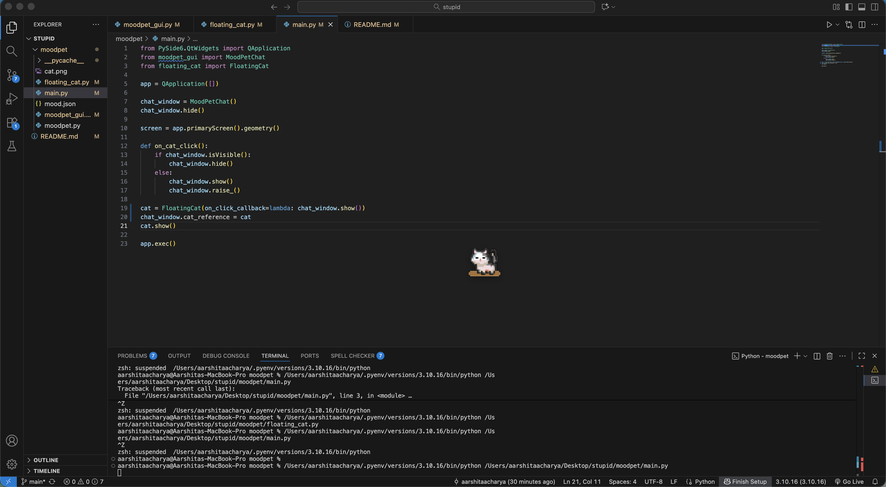
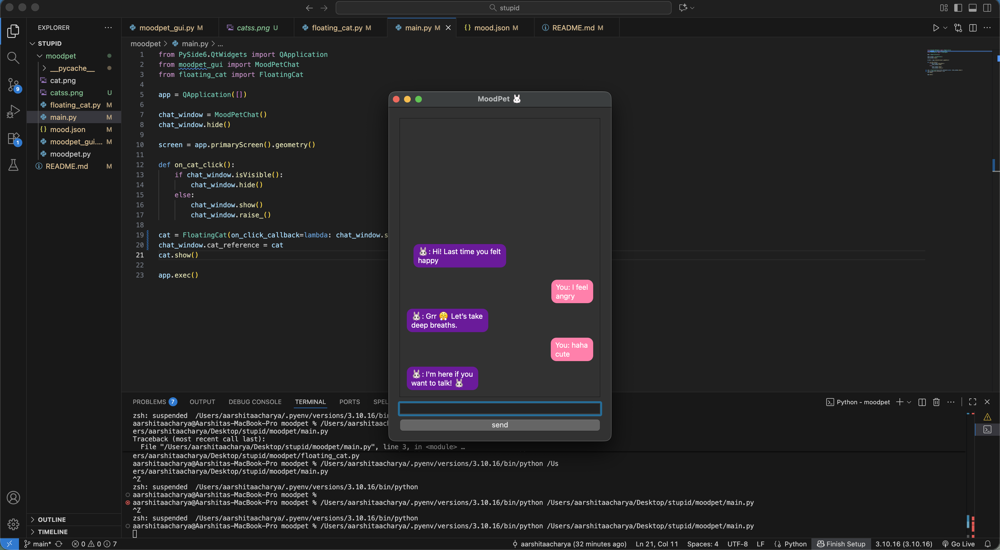

# stupid-things-i-code-when-i-should-be-sleeping

## MoodPet 🐰

**MoodPet** is a cute pixelated virtual pet that floats around your screen and interacts with you. Click on the cat to open a chat window, where MoodPet responds to your mood. It’s designed for fun, motivation, and stress relief while coding.

